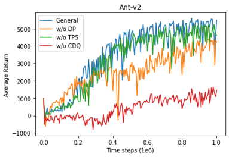

# TD3

## Set the parameters in block "Set the parameters" in `TD3_Ant.ipynb`:
* env_name = Name of enviroment
* seed = Random seed
* start_timesteps = When to start training TD3 model
* eval_freq = Frequency of evaluation
* max_timesteps = Maximum timesteps
* save_models = Need save model ?
* expl_noise = Exploration noise
* batch_size = Batch size
* discount = Discount factor 
* tau = The parameter to smoothly update targrt network in TD3 paper
* policy_noise = Policy noise to do target policy smoothing
* noise_clip = Maximum value of policy noise
* policy_freq = Frequency to update the actor and target networks

## Model Training:
    After setting up all parameters, just click the button "Run All", then you can train TD3 model and evaluate it. You can find the model file in the folder "./pytorch_models" and reward records of evaluations in "./results/[enviroment name]".

## Results:
  
* DP: Delayed Policy updates
* TPS: Target Policy Smoothing
* CDQ: Clipped Double Q-learning
